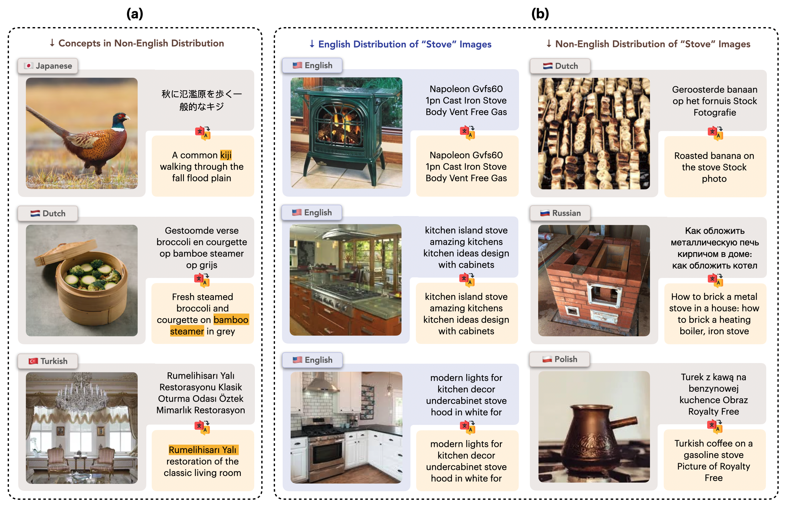

I am final year PhD student in computer science at the University of Washington advised by <a href="https://homes.cs.washington.edu/~ali/" style="color: hsl(230, 90%, 40%);">Ali Farhadi</a>. Before coming to Seattle, I received my bachelor's in math and physics and an MS in CS from Cornell University where I was advised by <a href="http://home.bharathh.info/" style="color: hsl(230, 90%, 40%);">Bharath Hariharan</a>. 
 
 
<b>Research Interests</b>

My goal is to build learning systems capable of understanding the rich underlying structure of the 3D world. My current research is focused on generating real-world, 3D environments and controllable video generation. Particularly I am interested in how to collect and structure data to train such models at scale. I've also worked on problems related to representation learning and model efficiency.

<em>I am on the job market this year. Feel free to reach out to discuss potential opportunities.</em>

<h2> Publications </h2>
<!-- First Paper -->

  <!-- A constantly looping GIF (assuming it's exported/created with infinite looping) -->
  
  
  <b>From an Image to a Scene: Learning to Imagine the World from a Million 360° Videos</b> 
  
    <u>Matthew Wallingford</u>, Anand Bhattad, Aditya Kusupati, Vivek Ramanujan, Matt Deitke, 
    Aniruddha Kembhavi, Roozbeh Mottaghi, Wei-Chiu Ma, Ali Farhadi
     
    <em><b>NeurIPS 2024</b></em>
     
    [
      <a href="https://arxiv.org/abs/2412.07770" style="font-size:15px; color: hsl(230, 90%, 40%);">
        pdf
      </a>
    ]
    [
      <a href="https://mattwallingford.github.io/ODIN/" style="font-size:15px; color: hsl(230, 90%, 40%);">
        webpage
      </a>
    ]
    [
      <a href="https://github.com/MattWallingford/360-1M" style="font-size:15px; color: hsl(230, 90%, 40%);">
        code
      </a>
    ]
  

<!-- Second Paper -->

  <!-- Another video thumbnail on the left -->
  

  <b>Multilingual Diversity Improves Vision-Language Representations</b> 
  
    Thao Nguyen, <u>Matthew Wallingford</u>, Sebastin Santy, Wei-Chiu Ma,
    Sewoong Oh, Ludwig Schmidt, Pang Wei Koh, Ranjay Krishna
     
    <em><b>NeurIPS 2024</b> [Spotlight]</em>
     
    [
      <a href="https://arxiv.org/abs/2406.05184" style="font-size:15px; color: hsl(230, 90%, 40%);">
        pdf
      </a>
    ]
  

<b>Superposed Decoding: Multiple Generations from a Single Autoregressive Inference Pass</b> 
Ethan Shen, Alan Fan, Sarah M Pratt, Jae Sung Park, <u>Matthew Wallingford</u>, Sham M. Kakade, Ari Holtzman, Ranjay Krishna, Ali Farhadi, Aditya Kusupati 
<em><b>NeurIPS</b> <b>2024</b></em> [<a href="https://arxiv.org/abs/2406.05184" style="font-size:15px;" style="color: hsl(230, 90%, 40%);">pdf</a>] [<a href="https://github.com/RAIVNLab/SuperposedDecoding" style="font-size:15px;" style="color: hsl(230, 90%, 40%);">code</a>]

<b>The Unmet Promise of Synthetic Training Images: Using Retrieved Real Images Performs Better</b> 
Scott Geng, Cheng-Yu Hsieh, Vivek Ramanujan, <u>Matthew Wallingford</u>, Chun-Liang Li, Ranjay Krishna, Pang Wei Koh 
<em><b>NeurIPS</b> <b>2024</b></em> [<a href="https://arxiv.org/abs/2406.05184" style="font-size:15px;" style="color: hsl(230, 90%, 40%);">pdf</a>] [<a href="https://github.com/scottgeng00/unmet-promise" style="font-size:15px;" style="color: hsl(230, 90%, 40%);">code</a>]

<b>Neural Priming for Sample-Efficient Adaptation</b> 
<u>Matthew Wallingford</u>, Vivek Ramanujan, Alex Fang, Aditya Kusupati, Roozbeh Mottaghi, Aniruddha Kembhavi, Ludwig Schmidt, Ali Farhadi 
<em><b>NeurIPS</b> <b>2023</b></em> [<a href="https://arxiv.org/abs/2306.10191" style="font-size:15px;" style="color: hsl(230, 90%, 40%);">pdf</a>] [<a href="https://github.com/RAIVNLab/neural-priming" style="font-size:15px;" style="color: hsl(230, 90%, 40%);">code</a>]

<b>Objaverse-XL: A Universe of 10M+ 3D Objects</b> 
Matt Deitke, Ruoshi Liu, <u>Matthew Wallingford</u>, Huong Ngo, Oscar Michel, Aditya Kusupati, Alan Fan, Christian Laforte, Vikram Voleti, Samir Yitzhak Gadre, Eli VanderBilt, Aniruddha Kembhavi, Carl Vondrick, Georgia Gkioxari, Kiana Ehsani, Ludwig Schmidt, Ali Farhadi 
<em><b>NeurIPS</b> <b>2023</b>, Benchmarks and Datasets</em> [<a href="https://objaverse.allenai.org/objaverse-xl-paper.pdf" style="font-size:15px;" style="color: hsl(230, 90%, 40%);">pdf</a>] [<a href="https://github.com/allenai/objaverse-xl" style="font-size:15px;" style="color: hsl(230, 90%, 40%);">code</a>]

<b>Neural Radiance Field Codebooks</b> 
<u>Matthew Wallingford</u>, Aditya Kusupati, Alex Fang, Vivek Ramanujan, Aniruddha Kembhavi, Roozbeh Mottaghi, Ali Farhadi 
<em><b>ICLR</b> <b>2023</b></em> [<a href="https://arxiv.org/abs/2301.04101" style="font-size:15px;" style="color: hsl(230, 90%, 40%);">pdf</a>] [<a href="https://github.com/MattWallingford/NeuralRadianceFieldCodebooks" style="font-size:15px;" style="color: hsl(230, 90%, 40%);">code</a>]

<b>FLUID: A Unified Evaluation Framework for Flexible Sequential Data</b> 
<u>Matthew Wallingford</u>, Aditya Kusupati, Keivan Alizadeh-Vahid, Aaron Walsman, Aniruddha Kembhavi, Ali Farhadi 
<em><b>TMLR</b> <b>2023</b></em> [<a href="https://arxiv.org/pdf/2007.02519.pdf" style="font-size:15px;" style="color: hsl(230, 90%, 40%);">pdf</a>] [<a href="https://github.com/RAIVNLab/FLUID" style="font-size:15px;" style="color: hsl(230, 90%, 40%);">code</a>]

<b>Matryoshka Representation Learning</b> 
Aditya Kusupati, Gantavya Bhatt, Aniket Rege, <u>Matthew Wallingford</u>, Aditya Sinha, Vivek Ramanujan, William Howard-Snyder, Kaifeng Chen, Sham Kakade, Prateek Jain, Ali Farhadi 
<em><b>NeurIPS</b> <b>2022</b></em> [<a href="https://arxiv.org/pdf/2205.13147.pdf" style="font-size:15px;" style="color: hsl(230, 90%, 40%);">pdf</a>] [<a href="https://github.com/RAIVNLab/MRL" style="font-size:15px;" style="color: hsl(230, 90%, 40%);">code</a>]

<b>Task Adaptive Parameter Sharing for Multi-Task Learning</b> 
<u>Matthew Wallingford</u>, Hao Li, Alessandro Achille, Avinash Ravichandran, Charless Fowlkes, Rahul Bhotika, Stefano Soatto 
<em><b>CVPR</b> <b>2022</b></em> [<a href="https://arxiv.org/pdf/2203.16708.pdf" style="font-size:15px;" style="color: hsl(230, 90%, 40%);">pdf</a>] [<a href="https://github.com/MattWallingford/TAPS" style="font-size:15px;" style="color: hsl(230, 90%, 40%);">code</a>]

<b>LLC: Accurate, Multi-purpose Learnt Low-dimensional Binary Codes</b> 
Aditya Kusupati, <u>Matthew Wallingford</u>, Vivek Ramanujan, Raghav Somani, Jae Sung Park, Krishna Pillutla, Prateek Jain, Sham Kakade, Ali Farhadi 
<em><b>NeurIPS</b> <b>2021</b></em> [<a href="https://arxiv.org/pdf/2106.01487.pdf" style="font-size:15px;" style="color: hsl(230, 90%, 40%);">pdf</a>] [<a href="https://github.com/RAIVNLab/LLC" style="font-size:15px;" style="color: hsl(230, 90%, 40%);">code</a>]

<b>RoboTHOR: An Open Simulation-to-Real Embodied AI Platform</b> 
Matt Deitke, Winson Han, Alvaro Herrasti, Aniruddha Kembhavi, Eric Kolve, Roozbeh Mottaghi, Jordi Salvador, Dustin Schwenk, Eli VanderBilt, <u>Matthew Wallingford</u>, Luca Weihs, Mark Yatskar, Ali Farhadi 
<em><b>CVPR</b> <b>2020</b></em> [<a href="https://arxiv.org/pdf/2203.16708.pdf" style="font-size:15px;" style="color: hsl(230, 90%, 40%);">pdf</a>] [<a href="https://github.com/allenai/robothor-challenge" style="font-size:15px;" style="color: hsl(230, 90%, 40%);">code</a>]

